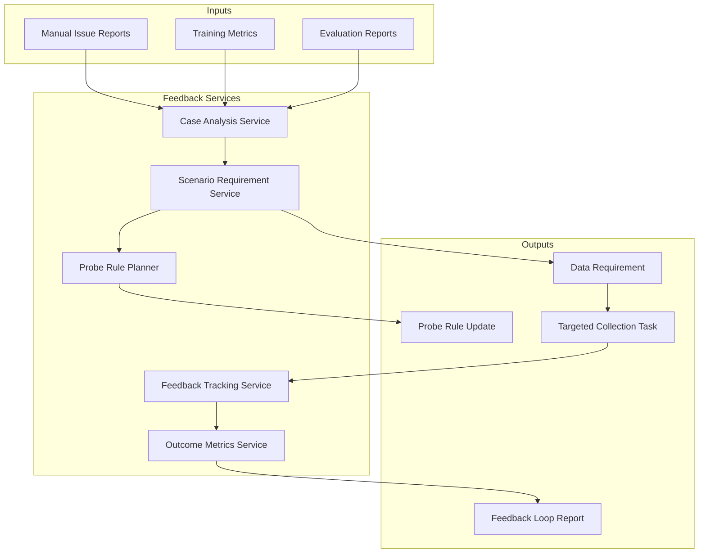

# Design Summary

[简体中文](design-summary.zh-CN.md)

## Design Intent

Phase 6 is the last step that makes the data loop meaningful. It takes weak points discovered in training and evaluation and converts them into new data production work.

The system should answer:

- Which model weakness was found?
- Which data and label versions exposed it?
- Which scenario needs more data?
- Which probe rule should be updated?
- Did the new data actually improve later model versions?

## Core Decisions

| ID | Decision | Rationale |
|---|---|---|
| D1 | Failed cases are structured records | Screenshots and notes are not enough for automation |
| D2 | Data requirements are scenario-level objects | Similar cases should be handled together |
| D3 | Probe rules are versioned | Collection rules need traceability and expiration control |
| D4 | Feedback tasks have priority and deadline | Collection resources are limited |
| D5 | Closed-loop outcome must be measured | New data is useful only if it improves downstream results |
| D6 | Feedback does not directly modify production behavior | Rules should pass review before deployment |

## Functional Architecture

## Main Entities

| Entity | Description |
|---|---|
| `feedback_case` | One failure, regression, or weak metric record |
| `data_requirement` | Scenario-level demand derived from cases |
| `probe_rule_update` | Proposed probe rule change for targeted collection |
| `collection_task` | Execution record for new data collection |
| `feedback_outcome` | Whether later data, labels, training, and evaluation improved |

## Non-Goals

Phase 6 does not include:

- Direct online control of vehicles.
- Automatic deployment of collection rules without review.
- Re-training models itself.
- Re-labeling data itself.
- Replacing human review for high-impact rule changes.

