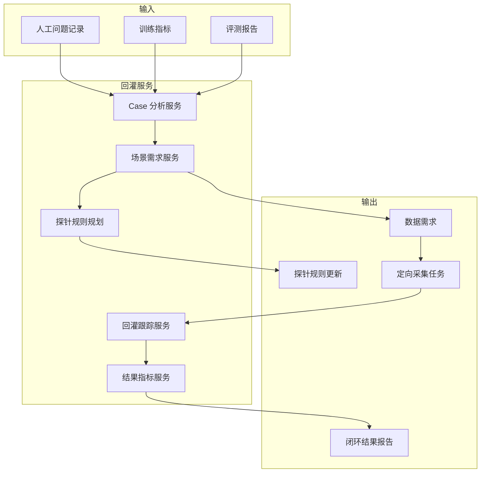

# 设计摘要

[English](design-summary.md)

## 设计意图

阶段六是让数据闭环真正有意义的最后一步。它把训练和评测中发现的薄弱点，转化为新的数据生产工作。

系统应该能回答：

- 发现了哪个模型短板？
- 哪些数据和标签版本暴露了这个问题？
- 哪类场景需要补充数据？
- 哪条探针规则应该更新？
- 新数据是否真的改善了后续模型版本？

## 核心设计结论

| 编号 | 设计结论 | 原因 |
|---|---|---|
| D1 | 失败 case 需要结构化记录 | 只有截图和备注不足以自动化流转 |
| D2 | 数据需求是场景级对象 | 相似问题应合并处理 |
| D3 | 探针规则需要版本化 | 采集规则需要可追溯和过期控制 |
| D4 | 回灌任务需要优先级和截止时间 | 采集资源有限 |
| D5 | 闭环结果必须可度量 | 新数据只有改善下游结果才有价值 |
| D6 | 回灌不直接修改生产行为 | 规则应经过评审后再部署 |

## 功能架构

## 主要实体

| 实体 | 说明 |
|---|---|
| `feedback_case` | 一个失败、回归或薄弱指标记录 |
| `data_requirement` | 由 case 汇总出的场景级数据需求 |
| `probe_rule_update` | 用于定向采集的探针规则变更建议 |
| `collection_task` | 新数据采集执行记录 |
| `feedback_outcome` | 后续数据、标签、训练和评测是否改善 |

## 非目标

阶段六不包含：

- 直接在线控制车辆。
- 未经评审自动部署采集规则。
- 模型重训练本身。
- 数据重标注本身。
- 用系统完全替代高影响规则变更的人审。

