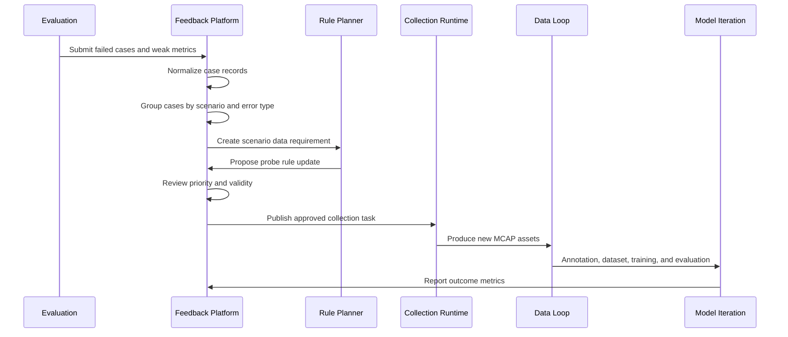
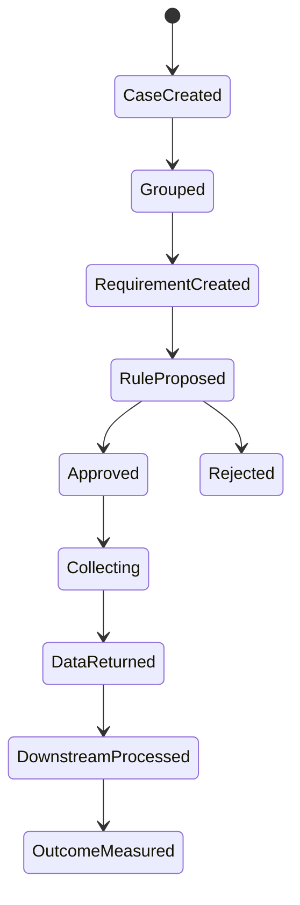

# Feedback Workflow

[简体中文](feedback-workflow.zh-CN.md)

## Main Workflow

## Feedback States

## Required Inputs

- Failed cases from Phase 5.
- Weak metrics from Phase 4 or Phase 5.
- Source data and label lineage.
- Scenario tags and error types.
- Collection constraints.

## Required Outputs

- Scenario data requirement.
- Probe rule update proposal.
- Targeted collection task.
- Feedback outcome report.

