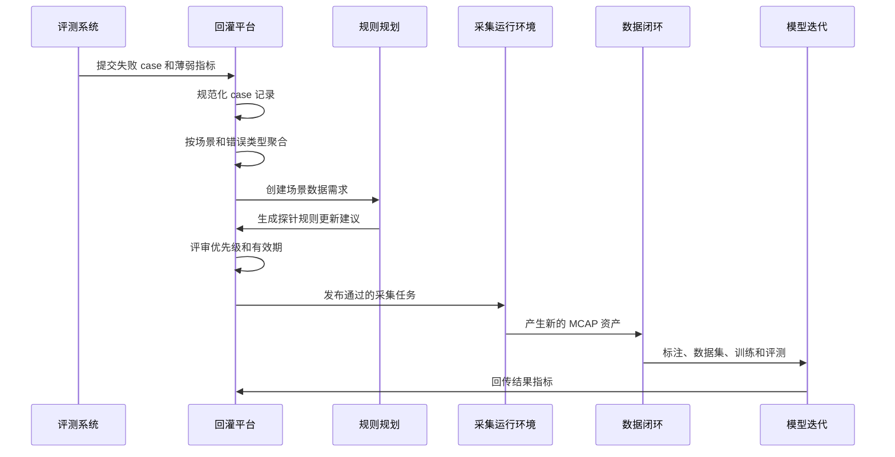
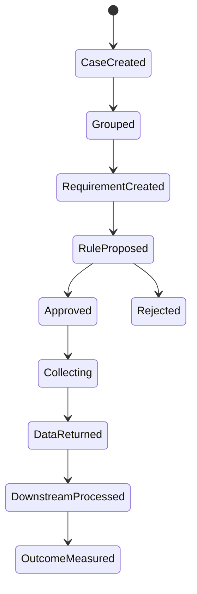

# 回灌流程

[English](feedback-workflow.md)

## 主流程

```mermaid
sequenceDiagram
  participant E as 评测系统
  participant F as 回灌平台
  participant R as 规则规划
  participant C as 采集运行环境
  participant D as 数据闭环
  participant M as 模型迭代

  E->>F: 提交失败 case 和薄弱指标
  F->>F: 规范化 case 记录
  F->>F: 按场景和错误类型聚合
  F->>R: 创建场景数据需求
  R->>F: 生成探针规则更新建议
  F->>F: 评审优先级和有效期
  F->>C: 发布通过的采集任务
  C->>D: 产生新的 MCAP 资产
  D->>M: 标注、数据集、训练和评测
  M->>F: 回传结果指标
```

## 回灌状态

```mermaid
stateDiagram-v2
  [*] --> CaseCreated
  CaseCreated --> Grouped
  Grouped --> RequirementCreated
  RequirementCreated --> RuleProposed
  RuleProposed --> Approved
  RuleProposed --> Rejected
  Approved --> Collecting
  Collecting --> DataReturned
  DataReturned --> DownstreamProcessed
  DownstreamProcessed --> OutcomeMeasured
```

## 必要输入

- 阶段五产出的失败 case。
- 阶段四或阶段五产出的薄弱指标。
- 来源数据和标签血缘。
- 场景标签和错误类型。
- 采集约束。

## 必要输出

- 场景数据需求。
- 探针规则更新建议。
- 定向采集任务。
- 回灌结果报告。

