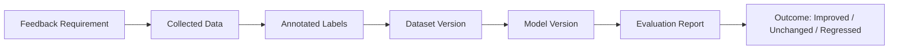

# Metrics and Governance

[简体中文](metrics-and-governance.zh-CN.md)

## Closed-Loop Metrics

| Metric | Meaning |
|---|---|
| Feedback case count | Number of issues entering feedback |
| Requirement conversion rate | Share of cases converted into data requirements |
| Collection completion rate | Whether targeted data was collected |
| Useful data rate | Share of collected data that passed annotation and QC |
| Metric improvement | Whether later models improved on the target scenario |
| Duplicate collection rate | Whether the rule collected redundant data |

## Governance Rules

Feedback-driven collection needs guardrails:

- Every rule should have an owner.
- Every rule should have an expiration time.
- Every rule should have a target count or budget.
- High-impact rules should require review.
- Duplicate requirements should be merged.
- Low-value rules should be retired.

## Outcome Tracking

## Why This Matters

Without governance, feedback rules can create too much data, duplicate data, or low-value data. Phase 6 should make collection more focused, not more chaotic.

