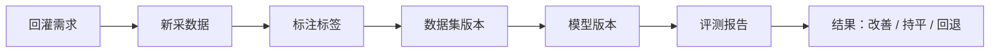

# 指标与治理

[English](metrics-and-governance.md)

## 闭环指标

| 指标 | 含义 |
|---|---|
| 回灌 case 数量 | 进入回灌的问题数量 |
| 需求转化率 | case 转化为数据需求的比例 |
| 采集完成率 | 定向数据是否完成采集 |
| 有效数据率 | 新采数据通过标注和质检的比例 |
| 指标改善情况 | 后续模型在目标场景是否改善 |
| 重复采集率 | 规则是否采到冗余数据 |

## 治理规则

问题回灌需要约束：

- 每条规则应有负责人。
- 每条规则应有过期时间。
- 每条规则应有目标数量或预算。
- 高影响规则应经过评审。
- 重复需求应合并。
- 低价值规则应下线。

## 结果跟踪

## 价值

如果缺少治理，回灌规则可能产生过多数据、重复数据或低价值数据。阶段六的目标是让采集更聚焦，而不是更混乱。

