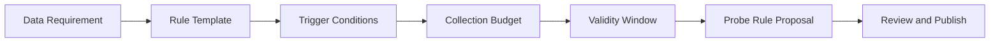

# Probe Rule Generation

[简体中文](probe-rule-generation.zh-CN.md)

## Purpose

Probe rules convert scenario-level data requirements into executable collection behavior.

A rule should describe:

- What scenario to capture.
- When it is valid.
- How much data to collect.
- Which topics or sensors are required.
- How the collected data should be uploaded.

## Rule Generation Flow

## Recommended Fields

| Field | Purpose |
|---|---|
| `probe_rule_id` | Rule identity |
| `requirement_id` | Source requirement |
| `priority` | Collection priority |
| `expire_at` | Avoid rules running forever |
| `target_count` | Desired sample count |
| `trigger` | Event, scene, or runtime condition |
| `capture_window` | Pre/post seconds |
| `upload_policy` | Upload timing and package limits |

## Review Rule

Probe rule proposals should be reviewed before deployment, especially when they affect bandwidth, storage, privacy, or runtime stability.

