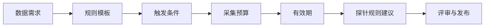

# 探针规则生成

[English](probe-rule-generation.md)

## 作用

探针规则将场景级数据需求转化为可执行的采集行为。

一条规则应描述：

- 要采集什么场景。
- 规则在什么时间内有效。
- 需要采集多少数据。
- 需要哪些 topic 或传感器。
- 采集后的数据如何上传。

## 规则生成流程

## 推荐字段

| 字段 | 作用 |
|---|---|
| `probe_rule_id` | 规则标识 |
| `requirement_id` | 来源需求 |
| `priority` | 采集优先级 |
| `expire_at` | 避免规则长期运行 |
| `target_count` | 目标样本数量 |
| `trigger` | 事件、场景或运行条件 |
| `capture_window` | 前后采集秒数 |
| `upload_policy` | 上传时机和数据包限制 |

## 评审规则

探针规则建议应在部署前经过评审，尤其是会影响带宽、存储、隐私或运行稳定性的规则。

